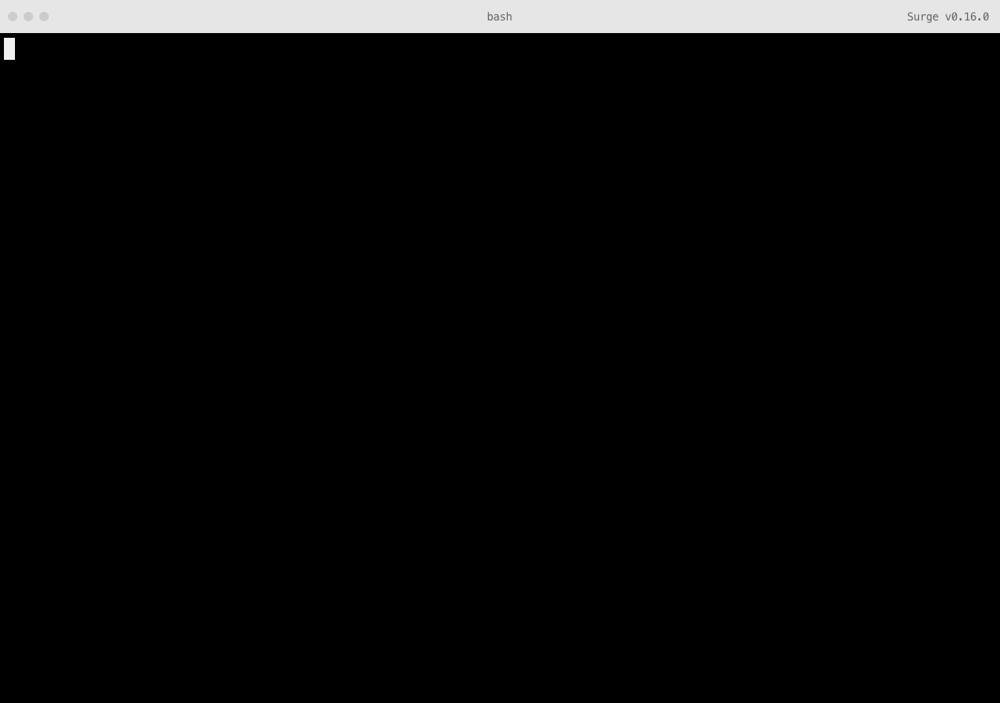

# Contributing

If you’d like to update the word lists, please open a Pull Request against Nina’s repo, rather than this one. The included JSON files are build from those source files automatically.

To run the project locally, first clone it by running the following command in your terminal:

```sh
# Clone the project
git clone https://github.com/kennethormandy/word-o-mat

# Move into the project directory
cd word-o-mat
```

Next, with a recent version of [Node.js installed](https://nodejs.org), install the project’s dependencies from [npm](https://npmjs.org), the package manager for JavaScript which came included with Node.js.

```sh
# Install dependencies
npm install
```

This will also install the word-o-mat RoboFont plugin as a development dependency, so you can rebuild the word lists, if you’d like. There is a build script already written to do this, which you can run using the following command:

```sh
# Rebuild the word lists
npm run build
```

If you’d like to make any changes, please consider adding a test for it first. You can run the existing tests with:

```sh
# Run the tests
npm test
```


